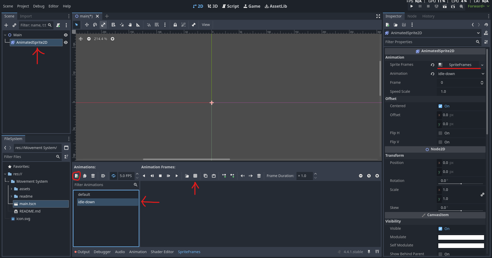
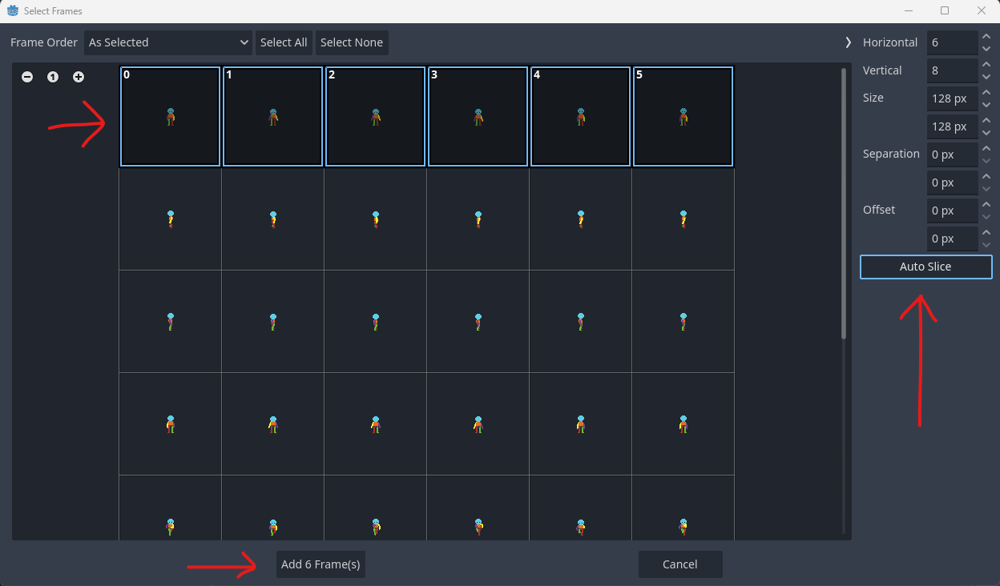
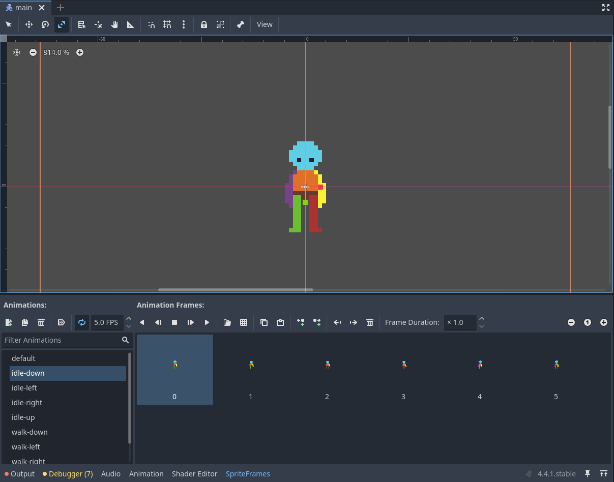
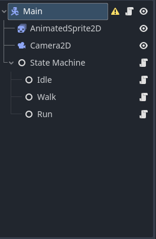
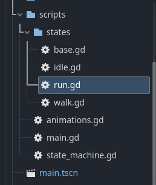

# State System

## Table of Contents
- [Project Settings](#project-settings)
  - [Inputs](#inputs)
  - [Rendering](#rendering)
- [Setting up AnimationSprite2D](#setting-up-animationsprite2d)
  - [AnimatedSprite2D Node](#animatedsprite2d-node)
  - [Adding Animation](#adding-animation)
  - [Animation Configuration](#animation-configuration)
  - [Animation Play](#animation-play)
- [State Machine Architecture](#state-machine-architecture)
  - [State Machine Overview](#state-machine-overview)
  - [State Scripts Architecture](#state-scripts-architecture)
  - [State Nodes Structure](#state-nodes-structure)
  - [Player Integration](#player-integration)
  - [State Transition Logic](#state-transition-logic)
  - [Animation Integration](#animation-integration)

## Project Settings

### Inputs

Sets the input keys that can be called in the project.
Used in the main.gd to control the player


### Rendering

Sets the Texture Render to Nearest for pixel art rendering


## Setting up AnimationSprite2D

### AnimatedSprite2D Node
Create a new AnimatedSprite2D node

* Set the *Sprite Frames* to a *New Sprite Frames*
* Add a new animation and give it name with the convention *animation-direction*



### Adding Animation
Adds the animation to the AnimatedSprite2D

* The Grid Icon will load the asset and allow for splicing the image into frames.



### Animation Configuration
If a animation is created with frames, you now have access to configure the animation.

* Loops
* Duration
* etc...



### Animation Play
Plays the animation with the given name

```gd
animated_sprite_2d.play( "animation-direction" )
```

## State Machine Architecture

### State Machine Overview

The `PlayerStateMachine` class manages all player states and handles transitions between them. It automatically discovers state nodes as children and provides a centralized system for state management.

* Automatically registers all `PlayerState` child nodes
* Manages current state and transitions
* Forwards input, update, and physics events to the active state
* Provides debug output for state changes

### State Scripts Architecture

All states inherit from the base `PlayerState` class, which provides a common interface:

```gd
base.gd
class_name PlayerState extends Node

static var player: Player
var state_machine: PlayerStateMachine

func enter():
	# Called when entering this state
	pass

func exit():
	# Called when leaving this state
	pass

func update(delta: float):
	# Called every frame while in this state
	pass
```

Individual states implement specific behavior and state transitions.

Examples:
* **IdleState**: Handles stationary player, transitions to walk/run on input
* **WalkState**: Manages normal movement speed and animations
* **RunState**: Handles faster movement when run button is held

### State Nodes Structure

States are organized as child nodes under the "State Machine" node in the scene tree:

```
Main (CharacterBody2D)
├── AnimatedSprite2D
├── Camera2D
└── State Machine (Node)
	├── Idle (Node)
	├── Walk (Node)
	└── Run (Node)
```

Each state node has its corresponding script attached that inherits from `PlayerState`.




### Player Integration

The player (`main.gd`) integrates with the state machine through several key components:

* **State Machine Reference**: `@onready var state_machine = $"State Machine"`
* **Animation Controller**: Handles animation updates based on state and direction
* **Movement Properties**: `current_direction`, `movement_speed` used by states
* **Direction Updates**: `update_direction()` method for calculating movement direction

```gd
main.gd

@onready var animated_sprite_2d = $AnimatedSprite2D
@onready var state_machine = $"State Machine"
@onready var animation_controller = preload("res://State System/scripts/animations.gd").new()

func _ready():
	animation_controller.player = self
	state_machine.start( "idle" )

func _physics_process(_delta):
	move_and_slide()

func update_direction( x: float, y : float ) -> Vector2:
	if y != 0:
		return Vector2(0, y).normalized()
	else:
		return Vector2(x, 0).normalized()
```

### State Transition Logic

States transition based on input conditions and current state:

**From Idle State:**
* Input detected → Walk State (normal) or Run State (if run button held)

**From Walk State:**
* No input → Idle State
* Run button pressed → Run State

**From Run State:**
* No input → Idle State
* Run button released → Walk State

```gd
walk.gd
# Example transition logic from WalkState

var direction = Input.get_vector( "left", "right", "up", "down" )

if direction == Vector2.ZERO:
	state_machine.change_state( "idle" )

elif Input.is_action_pressed( "run" ):
	state_machine.change_state( "run" )
```

### Animation Integration

The animation system works through the `animation_controller`:

* States call `player.animation_controller.update_animation( "state_name" )`
* Animation controller determines direction based on `player.current_direction`
* Combines state name with direction: `"walk-down"`, `"idle-up"`, etc.
* Plays appropriate animation on `AnimatedSprite2D`

```gd
animations.gd
# Animation controller combines state and direction

func update_animation( state: String ) -> void:
	var direction = get_direction()
	player.animated_sprite_2d.play( state + "-" + direction )
```
